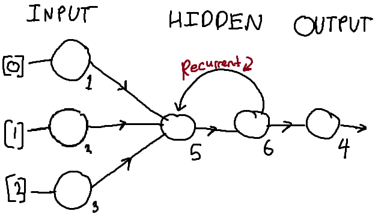

Supposedly, __doing__ is a very effective way to learn. The little creatures that I evolve show this pretty well.
#### I decided to put this to the test.

Firstly, I needed something to learn inside and out. So I decided to try my luck making a javascript version of NEAT.W

[NEAT](http://nn.cs.utexas.edu/downloads/papers/stanley.ec02.pdf) is my favorite evolutionary algorithm (and probably should be yours too). Before today, I've been using online libraries that someone _else_ wrote, like [this one](https://github.com/wagenaartje/neataptic). Now, I know those are much more efficient and work **alot** better, but what kinda learner would I be if I didn't try to make it myself from scratch?
So, here goes nothing.

### Skeleton creation
I started this educational&mdash;but somewhat superfluous&mdash;excersize by reading and re-reading the NEAT paper. I opened a new html file and started typing away. I really wanted this project to be well documented and well laid out. So, I took to about 30 A4 pieces of paper and the whiteboard in my room to try and map out what I wanted out of this project.

My first priority when I start a project is finishing the class skeletons. I like to lay out the classes in my project, with the constructor and the functions' functionality laid out. So, for example I made a "Genome" class which has the functions "add_node_mutation" and "add_connection_mutation". I would then comment what these functions need to do according to the paper's instructions. After I make the skeleton outline, I then start to implement the functions. This makes each function its own testable workspace that I can move on from once I succeed.

### Problems!?!?!!?
All good things come to an end, right? Well in my case the good thing was _confusion-free programming_, which, keeping true to the legend, came to an end.

{: .center-block :}

This all started when I realised the paper did not give any information about how to deal with recurrent connections. Previously, I assumed that once every frame, we completely feed forward each genome's neural network. This means we give in an input vector, do all the feedforwarding until we get the output vector. After this, I assumed, we wipe the neurons in the network, and do it again with a new set of inputs. But, how would recurrent connections work then? would I need to store their values and then apply them the next execution of the network? 

I could have just assumed this and programmed it like that, but I wanted to stay true to the paper, and who knows the paper better than the author himself? I emailed [Professor Kenneth O. Stanley](https://www.cs.ucf.edu/~kstanley/) on the off chance that he would reply.Fortunately for the accuracy of my project, he replied and explained what the paper's implementation of the recurrent connection was. Through this new information, I realized that I got the activation methodology of the genome's network completely _wrong_. Thank god I hadn't started programming that part, huh?

Aparently, every timestep, the information travels down the length of _one_ connection. So, instead of the network being completely evaluated every frame, there is a slight time-lag between each neuron activation (much like in a human brain). This means that recurrent connections just act like any other connection, except for the fact that it connects to a node behind it. This simplified the program by a lot, as I would not need to manually check for recurrent connections. Feeling pretty good about myself, I got back to programming. 

