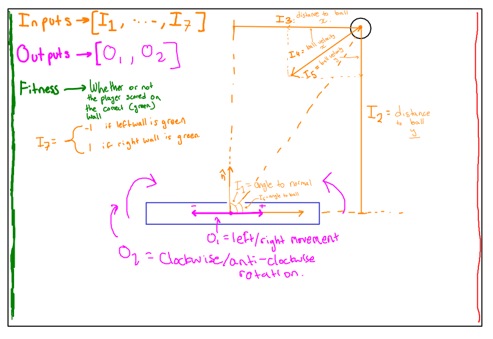
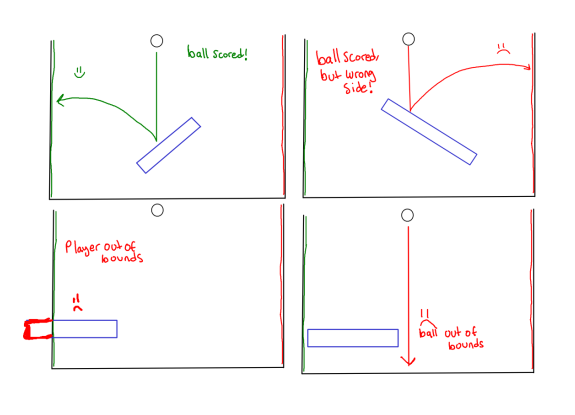
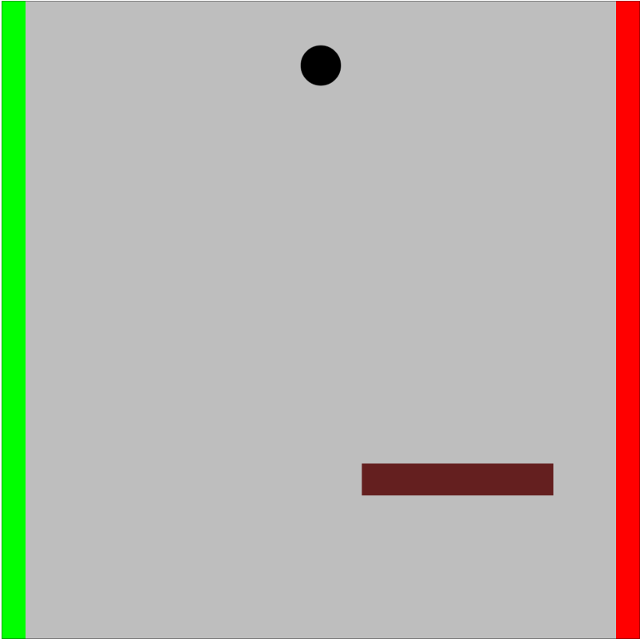
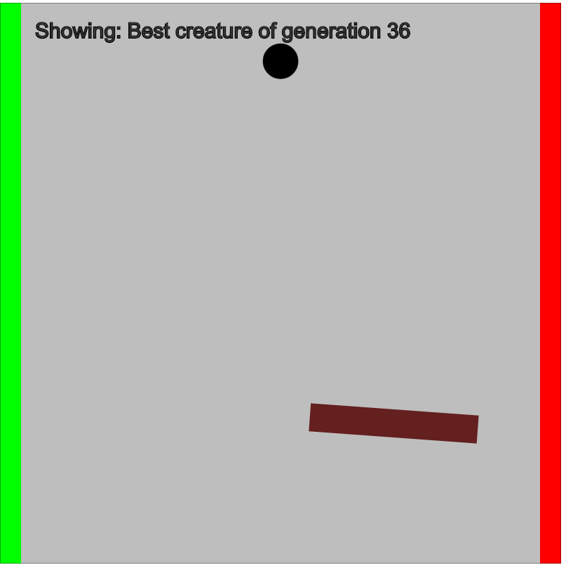

## Basic inputs and outputs for the neural network controller:

## How the creature can gain (:smile:) or lose (:frowning_face:) fitness

### Results
This is the result after a few generations of training. Some of them have inverted brains and score on the RED side, but most of them learn to bounce the ball on the green wall, scoring repeatedly:

#### Here's another example of some interesting behaviour:
This one stays in place until the ball comes in short so it moves to the left to catch it.

#### I made the paddle much shorter, to see what happens:
They developed the behaviour to catch their own rebound off the wall between generation 14-15. They then learned how to hit it up into the air and then score with a somewhat obscure strategy (generation 19).

