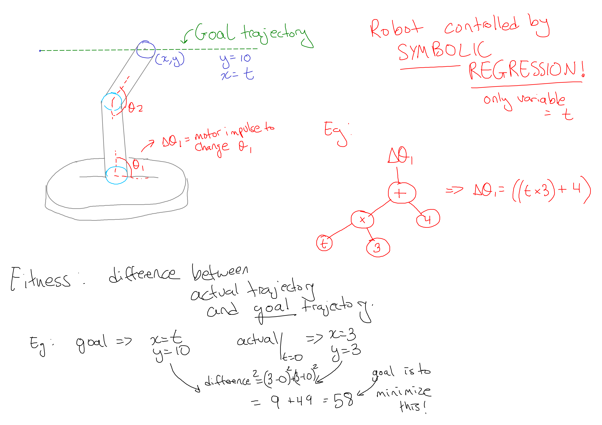

[Run the project in your browser](https://ryanboldi.github.io/RobotArm/) 

(Start drawing at the tip of the robot's arm and release mouse at the end of the path)

## What is symbolic regression?

I like to think of it as the evolution as a mathematical expression. It is very close to the evolution of a neural network, but instead of neurons, we have 'processing units' that contain either a simple mathematical function (like addition) or a value (like 3.14).

The output is a somewhat illegible function that is (if done well) an accurate regression of the training data that can be used to predict new data points.

#### Here is how I attempted to implement it in this project:

