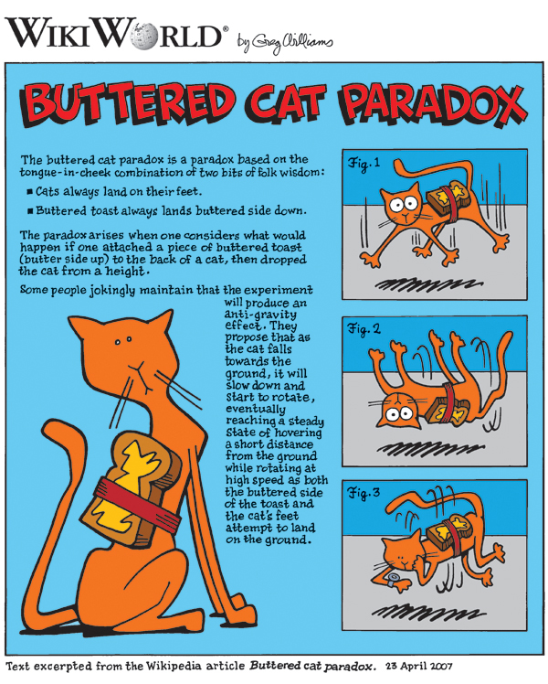

I'm sure we have all seen the "Buttered Cat Paradox": \

Inspired by this, I decided to see if I could evolve some shapes that do the same thing!
The goal for this project is to use a [compositional pattern producing network](https://en.wikipedia.org/wiki/Compositional_pattern-producing_network) to create a 2d object that will be dropped at different angles. They will all be assessed by how similar the resting final position is to being correct. Heres a drawing of my planning process:

# Compositional Pattern Producing Network

# How the CPPN will generate a usable mesh

# Testing
After implementing the physics engine, collision handling and drop system, I tested dropping pre-made shapes at different angles.

This was surprisingly very difficult due to the concave nature of the shapes I am dealing with in this project. I first tried treating each shape as a singluar object with many vertice and relying on the physics engine to decompose the shape into convex shapes. This ended up creating some very weird looking shapes that completely killed the performace of the game. I ended up just treating the objects as a collection of many square objects (each pixel is one object).